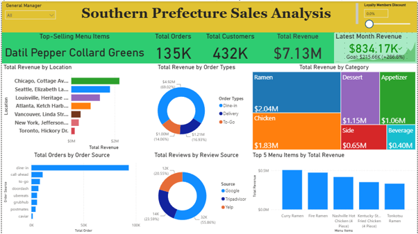
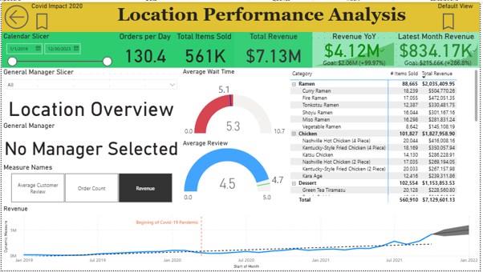
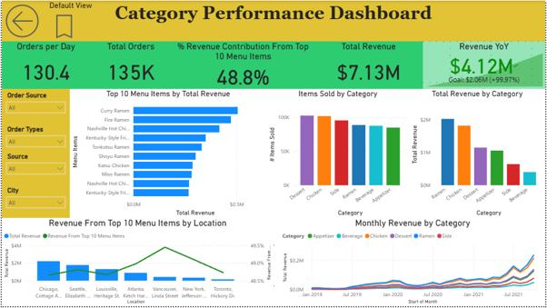
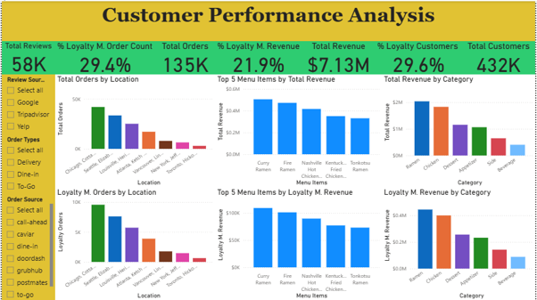

# southern-prefecture-sales-analysis
A comprehensive review of sales performance across categories, regions, and customer segments, highlighting revenue drivers, growth trends, and strategic opportunities.

## Project Overview

Businesses generate vast amounts of sales data every day, but raw figures alone rarely provide the clarity needed for strategic decision-making. This project showcases how Microsoft Power BI can transform transactional retail data into actionable business intelligence through interactive dashboards.
Using a Southern Prefecture sales dataset sourced from Kaggle, the data was cleaned, transformed, and modeled to evaluate performance across multiple dimensions — including menu items, customers, order types, order sources, regions, and monthly sales trends.
The resulting dashboards empower decision-makers to monitor overall business performance, identify growth opportunities across categories and locations, track customer behavior and operational efficiency, support data-driven strategies with clear visual insights by bridging raw data with intuitive visualization, this project demonstrates the value of Power BI in enabling smarter, faster, and more informed business decisions.

---

## Table of Contents

* [Project Overview](#project-overview)
* [Business Objective](#business-objective)
* [Dataset & Data Preparation](#dataset--data-preparation)
* [Tools & Technologies](#tools--technologies)
* [Analytical Approach](#analytical-approach)

  * [Power BI Analysis](#power-bi-analysis)
* [Key Business Metrics](#key-business-metrics)
* [Key Findings](#key-findings)
* [Key Business Conclusions](#key-business-conclusions)
* [Business Recommendations](#business-recommendations)
* [Portfolio Evidence](#portfolio-evidence)
* [Project Files](#project-files)
* [Analytical Workflow](#analytical-workflow)
* [Acknowledgements](#acknowledgements)
* [Author](#author)

---

## Business Objective

The objective of this project was to understand:

* Overall sales and loyalty member performance
* Customer and order behavior
* Category and menu items performance
* Regional differences in business performance
* The relationship between customer and loyalty member
The analysis was designed to move beyond revenue reporting and evaluate whether sales were translating into sustainable growth.

---

## Dataset & Data Preparation

The original dataset consisted of eight tables: locations, menu item categories, menu items, order details 2019, order details 2020, order details 2021, orders, and reviews, containing a total of 135,201 records.
During the cleaning process, the three yearly order detail tables (2019, 2020, 2021) were merged into a single order details table. A custom calendar date table was also created to complement the order date.
Inconsistencies were addressed by identifying and removing 229 duplicate rows, resulting in a final analytical dataset of 134,972 records.
Power Query was used extensively for data cleaning, transformation, and feature engineering before loading the prepared dataset into the Power BI model and visuals.
Key transformations included:
* Date-related features
* Order types
* Loyalty member flag
* Wait time in minutes
* Total, tax amount, and total with tax
* Location name standardization
* Loyalty member discount analysis

---

## Tools & Technologies
* Power BI
* Power Query
* Data Modeling
* DAX
* Advanced DAX
* Visualization

---

## Analytical Approach

### Power BI Analysis

The cleaned dataset was loaded into Power BI Desktop to create an interactive four-page dashboard:

1. **Executive Dashboard** — overall business performance and KPI monitoring
2. **Location Analysis** — location-level sales and order performance
3. **Category Analysis** — category and menu items performance
4. **Customer Analysis** — comparison of customer and loyalty member

The report uses DAX measures, interactive filtering, bookmarks and drillthrough functionality to support deeper analysis.

---

## Key Business Metrics

| Metric          |        Result |
| --------------- | ------------: |
| Total Revenue     | $7,129,601.13 |
| Loyalty Member Revenue    |   $1,561,016.61 |
| Total Customers   |        432,061 |
| Distinct Orders |        134,972 |
| Quantity Sold   |        560,910 |
| Menu Items  |            36 |

---

## Key Findings

###  Revenue Breakdown
 Ramen and Chicken dominated, accounting for 54% of total revenue, while Beverages contributed the least. There is notable variation in the number of menu items sold compared to revenue share.

### Location Performance
Chicago and Seattle were strong contributors, generating 56% of total and loyalty member revenue. Vancouver, New York, and Toronto ranked lowest in revenue contribution.

### Menu Items Insights
Top revenue drivers: Curry Ramen, Fire Ramen, and Nashville Hot Chicken (4 piece). Most sold items: Datil Pepper Collard Greens, Green Tea Tiramisu, Nashville Hot Chicken (4 piece), Kentucky-Style Fried Chicken (2 piece), and Moshi Sampler.

### Customer and Loyalty Member Growth
Customer base grew impressively with a 100% year-on-year increase. Loyalty members contributed 22% of total revenue, 29% of customer base, and 29% of total orders.

### Order Types
Dine-in orders accounted for 69% of total order revenue.

###  Reviews
Google was the leading platform, representing 55% of all reviews.

---

## Key Business Conclusions
The business shows strong momentum, with Ramen and Chicken categories and Chicago and Seattle regions driving most of the revenue. However, performance is uneven, beverages and certain cities underperform, creating concentration risks. Menu dynamics reveal that high-revenue items differ from high-volume sellers, highlighting a split between premium earners and popular staples. Customer growth is impressive at 100% year-on-year, and loyalty members are highly engaged, though their revenue share remains modest. Dine-in dominates order revenue, suggesting reliance on in-store experiences, while delivery and to-go channels remain underutilized. Reputation is largely shaped by Google reviews, making it the most influential platform for customer perception.

---

## Business Recommendations

### Grow
•	Expand loyalty programs to convert high engagement into higher revenue share.

•	Replicate successful strategies from Chicago and Seattle in weaker markets to balance geographic dependence.

•	Promote premium menu items (like Curry Ramen and Fire Ramen) while bundling or upselling popular staples to maximize both revenue and volume.
### Protect
•	Strengthen dine-in experience since it accounts for 69% of revenue, but simultaneously build resilience by improving delivery and to-go channels.

•	Focus on reputation management, especially on Google, to protect brand perception and sustain growth.
### Optimize:
•	Reassess and innovate the beverage category to reduce underperformance.

•	Use data-driven promotions to align menu pricing with customer demand patterns.

•	Target underperforming cities with localized marketing and menu adjustments to lift their contribution.

---

## Portfolio Evidence

This repository contains the Power BI analysis and supporting visual evidence from the Power BI dashboard.

The project demonstrates an end-to-end analytical workflow:

**Data Cleaning → Feature Engineering → Exploratory Data Analysis → Power BI → Business Insights → Recommendations**

## Power BI Dashboard

### Executive Dashboard



### Location Dashboard



### Category Dashboard



### Customer Dashboard



---

## Project Files

* **Power BI Dashboard** — [View the Power BI report](southern_prefecture_sales_analysis.pbix)
* **Dashboard Screenshots** — [View all dashboard pages](dashboards/)

## Analytical Workflow

**Original Dataset → Power  Query → Data Cleaning → Exploratory Data Analysis → Power BI Data Modelling → DAX Measures → Interactive Dashboard → Business Insights & Recommendations**

---

## Project Structure

```text
superstore-sales-profitability-analysis/
│
├── README.md
│
├── notebooks/
│   └── southern_prefecture_sales_analysis.ipynb
│
├── dashboards/
│   ├── executive_dashboard.png
│   ├── location_analysis.png
│   ├── category_analysis.png
│   ├── customer_analysis.png
└── data/
    └── README.md

```

## Author

**Quadri Akanbi Olahassan**

**Petroleum Engineer | Data Analytics | Transitioning into Machine Learning**

---

## Acknowledgements

This project was developed as part of my ongoing data analytics and machine learning journey.

The analysis uses the **Sample Southern Prefecture  dataset**, a widely used practice dataset for exploring sales, customer, product, and regional business performance.

I acknowledge the original dataset source and the broader data analytics learning community for providing resources and examples that supported the development of this project.

All analysis, data preparation, Power BI modelling, DAX measures, dashboard development, business conclusions, and recommendations presented in this repository were independently performed as part of this portfolio project.
